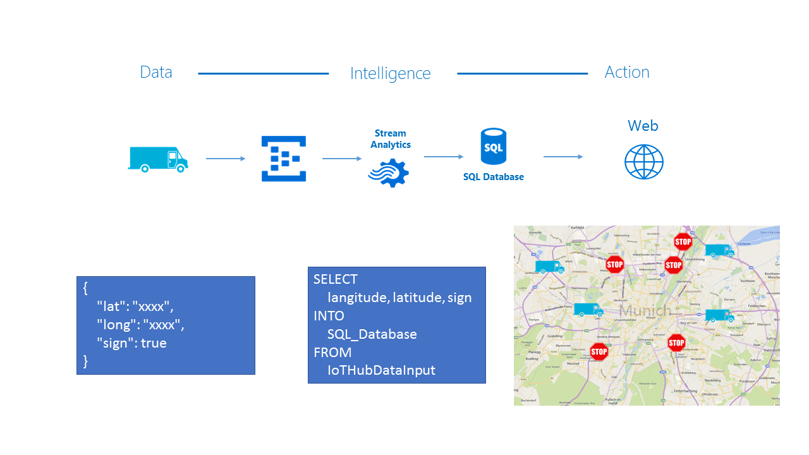
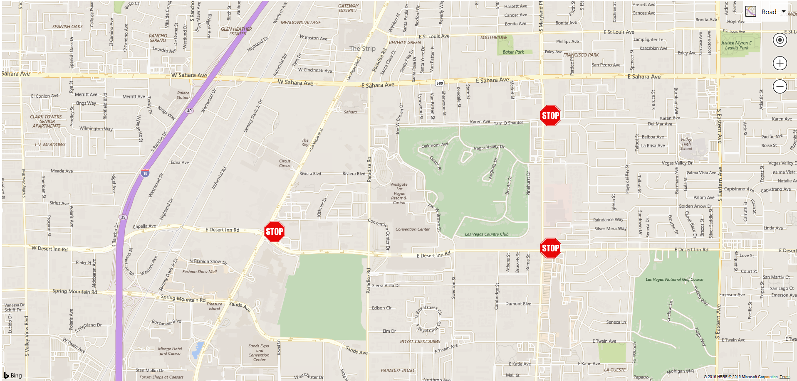

# StreetSignDetect
Detect Street signs and display in Bing Maps

## Architecture

The architecture of the pipeline is given below. It includes the sending device (car) which sends data to an IoTHub. Then, a StreamAnalytics job picks up this data and sends it to a SQL database. The Web Application, which displays the data then gets changes from the database and displays it in a Bing Maps view on the ASP.Net website. 



## Contents

The repository features 2 applications: 

1. A data generator that creates random data files in the following JSON format. This is send via the IoTHub, over a Stream Analytics Service to a SQL Database.

```json
{
    "DeviceID":"BlueBox1", 
    "Latitude": 30.272164093811060, 
    "Longitude": -97.739044053646921, 
    "StreetSign": "STOP"
}
```

2. An ASP.Net website, which displays a interactive Bing Maps UI, which displays the latest STOP signs stored in the SQL database.



## Getting started

To run the application, you need to build the IoTHub, StreamAnalytics job and SQL database yourself. You can find guidance on how to do this here:

- [IoTHub](https://azure.microsoft.com/en-us/develop/iot/)
- [Stream Analytics](https://docs.microsoft.com/en-us/azure/stream-analytics/stream-analytics-introduction)

    ```sql
    SELECT
        DeviceID, Latitude, Longitude, StreetSign, 
        EventEnqueuedUtcTime AS [TimeStamp]
    INTO
        SQLOutput
    FROM
        IoTHubInput
    ```

- [SQL Database](https://docs.microsoft.com/en-us/azure/sql-database/sql-database-technical-overview)

    SQL Database query can look something like this: 

    ```sql
    SELECT TOP (1000) [DeviceID]
        ,[Latitude]
        ,[Longitude]
        ,[StreetSign]
        ,[TimeStamp]
    FROM [dbo].[locationdata]
    ```

After you created the pipeline, you need to ensure the following settings:

1. Set your SQL credentials in the Web.config file of the SignalRService. Replace the connectionString value with valid SQL credentials.

```xml
<connectionStrings>
    <add name="DbConnection"
         connectionString="ADD YOUR SQL CREDENTIALS HERE"
         providerName="System.Data.SqlClient" />
  </connectionStrings>
```

2. Add a credentials file to your DataGenerator, that looks like the class below. Replace the IoTHub Uri und Device Key to connect to your pipeline.

```csharp
namespace DataGenerator.Objects
{
    public static class Credentials
    {
        public static string IOT_HUB_URI = "IoTHub URI";
        public static string DEVICE_KEY = "DEVICE KEY";
    }
}
```


